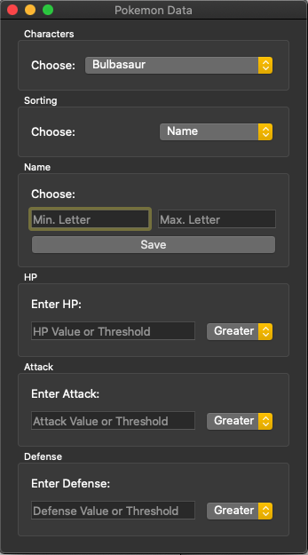
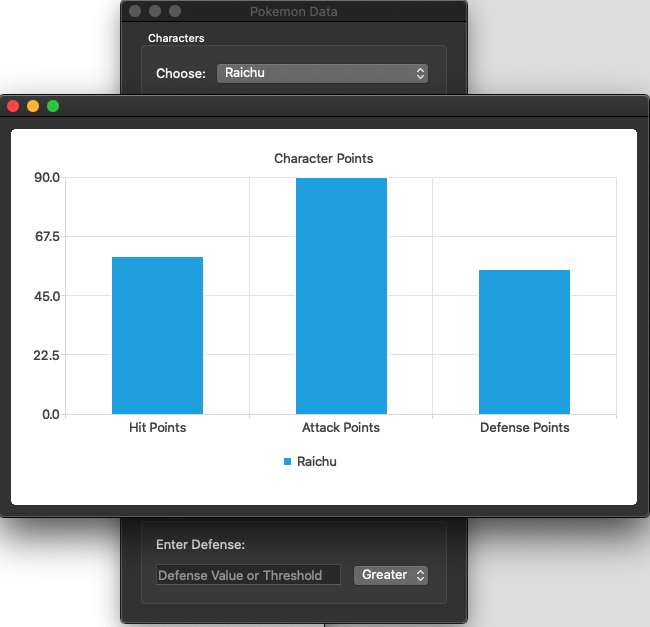
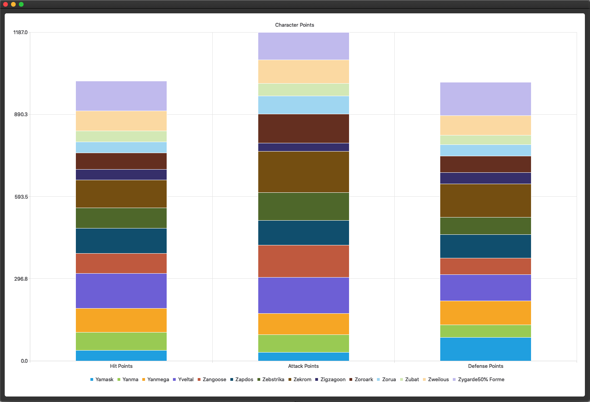
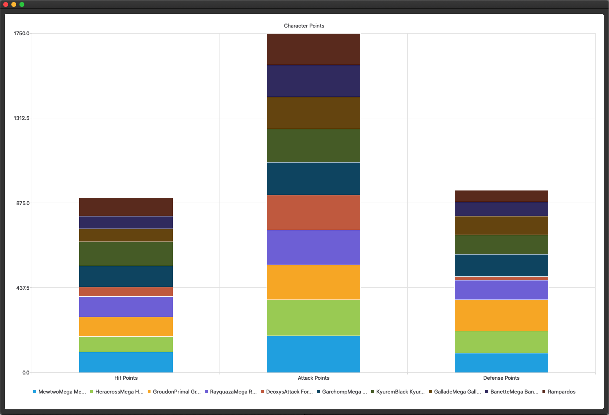

# pokemon-data-visualization
## Qt GUI

* Designed and implemented graphical user interface using C++ and Qt to search and display bar charts of character statistics. 
* Specified search by ranges of name or statistic value such as HP, Attack, and Defense. 

### User Input Dialog 

### Ex: Raichu Bar Chart

### Ex: Pokemon Names Y-Z
 

### Ex: Top Ten Attack Pokemon

